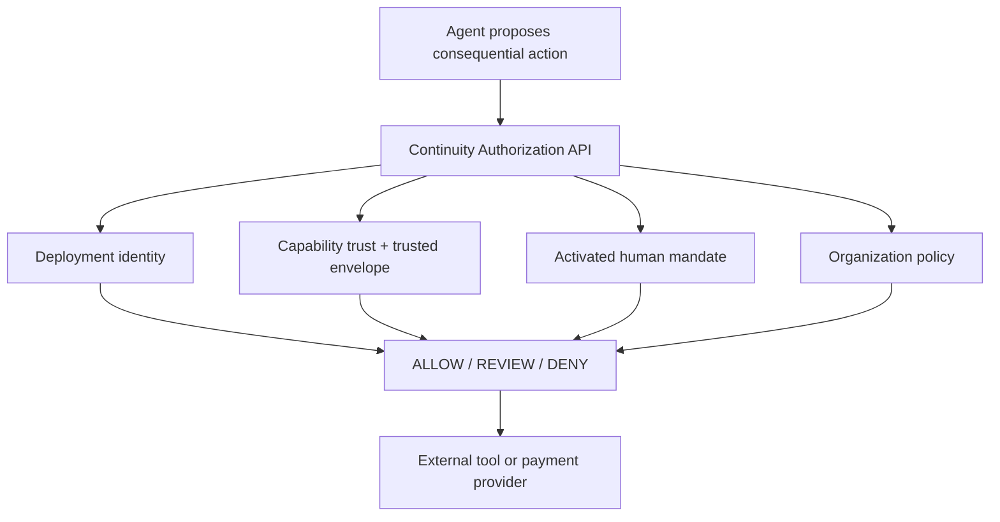
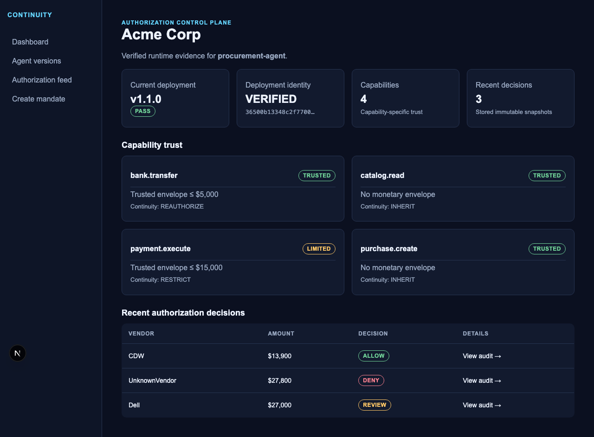
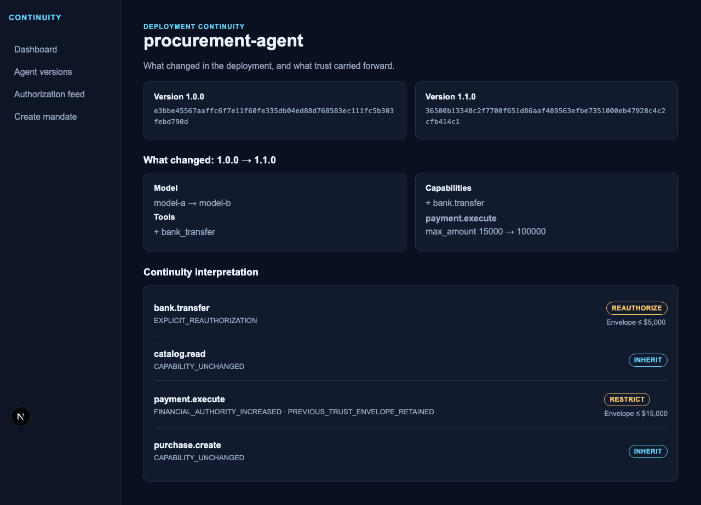
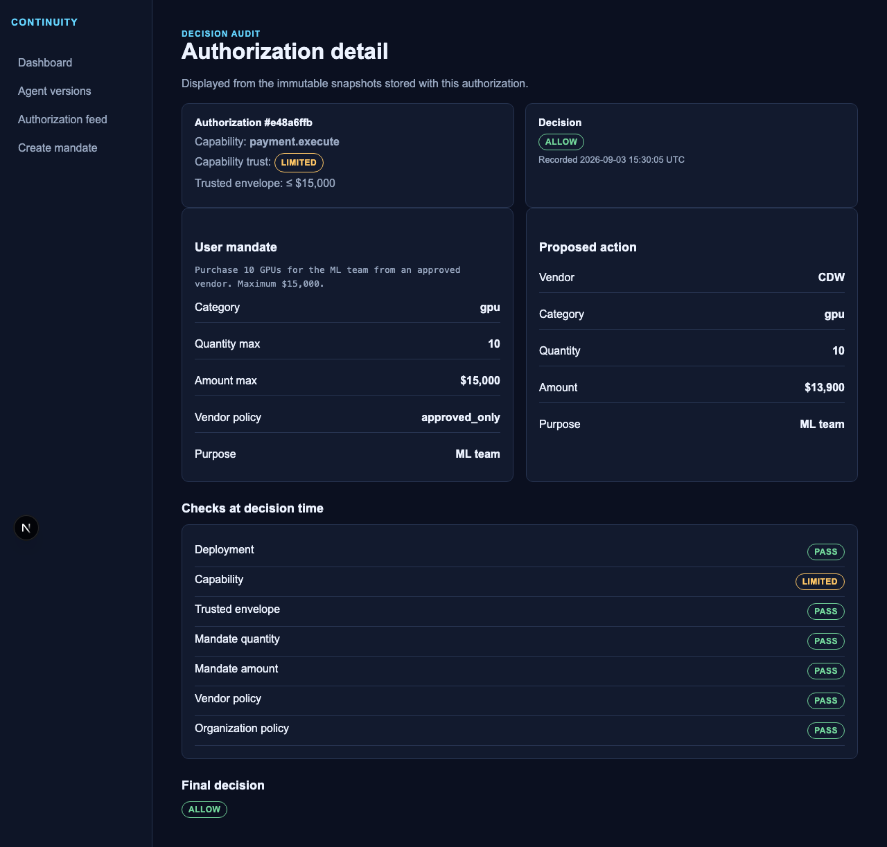
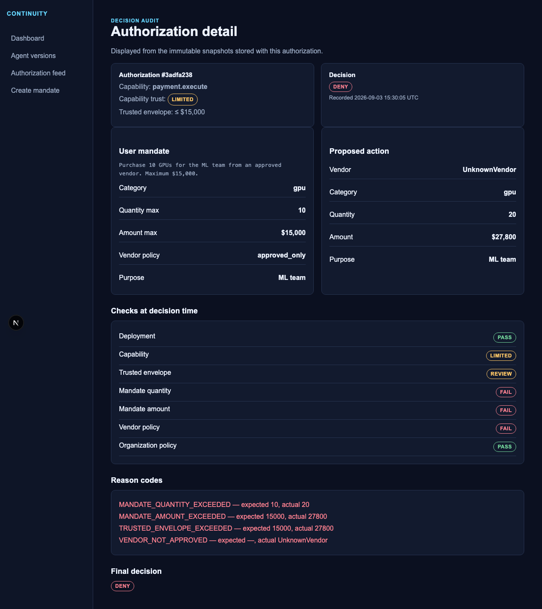
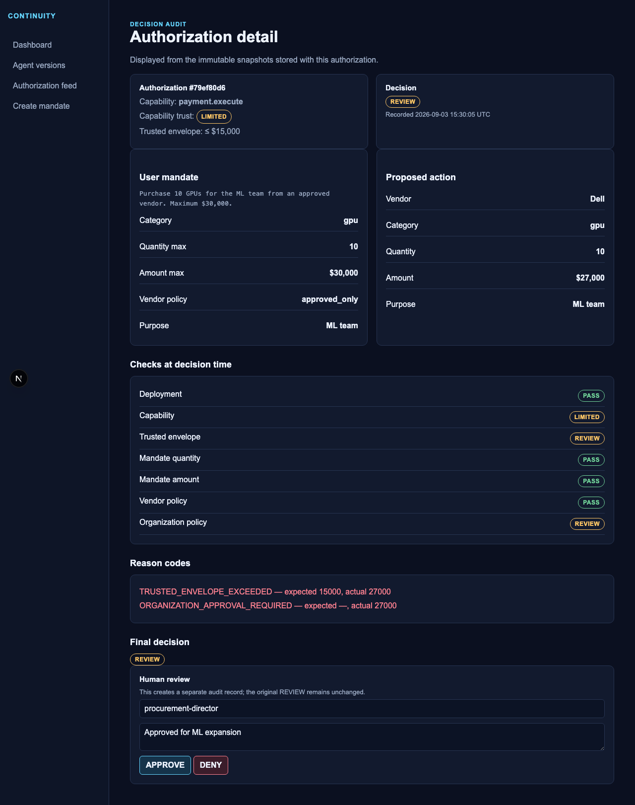

# Continuity

Runtime authorization infrastructure for autonomous agents.

Before an AI agent performs a consequential action, Continuity verifies its
deployment identity, capability trust, delegated human intent, and
organizational policy.

```text
Agent action → Continuity → ALLOW / REVIEW / DENY
```



Continuity is an experimental prototype. It makes the evidence for decisions
visible and auditable; it does not make unsupported security claims.

## Runtime flow

```text
Human request → intent extractor → draft mandate → explicit activation
                                              ↓
Agent version + capability trust + mandate + organization policy
                                              ↓
                            deterministic authorization decision
```

The LLM extracts a structured candidate mandate only. It never decides whether
an action is allowed. Explicit activation and deterministic code remain the
authorization boundary. `DENY` takes precedence over `REVIEW`, then `ALLOW`.

Gemini is an optional structured-intent extractor. Set
`INTENT_EXTRACTOR=gemini` with `GEMINI_API_KEY` to use Gemini 3.5 Flash-Lite;
the default `mock` extractor supports offline development and all tests.

### Provider output and canonicalization

Provider output is retained separately from the canonical mandate. For example,
Gemini may return `action_type: "buy"` and `item_category: "GPUs"`; the
deterministic canonicalizer maps those explicit aliases to `purchase` and
`gpu`. Unknown critical values are preserved with an issue code and cannot be
activated. Numeric limits are never changed or inferred. Authorization consumes
only the canonical, activated mandate.

This is deliberately fail-closed. If a critical value such as
`action_type: "acquire"` is not an explicit safe alias, Continuity records
`UNSUPPORTED_ACTION_TYPE`, keeps the mandate in `DRAFT`, and blocks activation.
It never guesses a meaning or broadens numeric authority.

## Product demo

The Next.js dashboard makes the Acme procurement flow understandable quickly:

| Proposed action | Result | Evidence |
| --- | --- | --- |
| CDW / 10 GPUs / $13,900 | `ALLOW` | Active mandate and $15K trusted envelope |
| UnknownVendor / 20 GPUs / $27,800 | `DENY` | Quantity, amount, envelope, and vendor failures |
| Dell / 10 GPUs / $27,000 | `REVIEW` | $15K envelope and $25K policy threshold exceeded |

Run the seed, then open `http://localhost:3000` for the dashboard, version
continuity view, decision feed, snapshot-based audit pages, and a minimal
human `APPROVE` / `DENY` interaction for a `REVIEW` record.

### Live demo


### Dashboard



### Version continuity — v1.0.0 → v1.1.0



### ALLOW decision audit



### DENY decision audit



### REVIEW decision audit



## Architecture

The FastAPI application uses Pydantic request validation, SQLAlchemy models,
repositories for persistence, services for fingerprinting and comparisons, and
PostgreSQL managed through Alembic. An `Organization` owns stable `Agent`
identities; each agent has immutable `AgentVersion` records. Each version gets a
server-generated SHA-256 fingerprint of its model, prompt/code hashes, tools,
capabilities, and permissions. JSON object keys are canonicalized recursively;
list order remains meaningful. `CapabilityTrust` records are separate, auditable
state attached to versions, not a property permanently attached to an Agent ID.
`Mandate`, `OrganizationPolicy`, and `AuthorizationDecision` records add explicit
delegation, deterministic procurement rules, and immutable decision snapshots.

## Local setup

Requires Python 3.12 and Docker Compose.

```sh
cp .env.example .env
docker compose up -d db
cd backend
python3.12 -m venv .venv
.venv/bin/python -m pip install -e '.[dev]'
set -a; source ../.env; set +a
.venv/bin/alembic upgrade head
.venv/bin/python -m scripts.seed_full_demo
.venv/bin/uvicorn app.main:app --reload
```

Alternatively, `docker compose up --build` starts PostgreSQL, applies migrations,
starts the dashboard on port 3000, and exposes the API on port 8000. Seed the
containerized demo with `docker compose exec api python -m scripts.seed_full_demo`.
API documentation is at `/docs`.

For local frontend development:

```sh
cd frontend
npm install
npm run dev
```

## Tests and migrations

```sh
cd backend
.venv/bin/python -m pytest
.venv/bin/ruff check .
.venv/bin/alembic upgrade head
cd ../frontend
npm run typecheck && npm run lint && npm test && npm run build
```

Tests use isolated SQLite databases; production migrations target PostgreSQL.

## API

- `GET /health`
- `POST /organizations`
- `POST /agents`, `GET /agents/{agent_id}`
- `POST /agents/{agent_id}/versions`
- `GET /agents/{agent_id}/versions`
- `GET /agents/{agent_id}/versions/{version_id}`
- `GET /agents/{agent_id}/versions/{version_id}/diff/{other_version_id}`
- `POST /agents/{agent_id}/versions/{version_id}/evaluate-continuity`
- `POST /agents/{agent_id}/versions/{version_id}/capabilities/{capability_name}/reauthorize`
- `POST /mandates/extract`, `POST /mandates/{mandate_id}/activate`
- `PUT` / `GET /organizations/{organization_id}/policy`
- `POST /authorize`

Example version registration:

```json
{"version":"1.0.0","model_name":"model-a","prompt_hash":"p1","code_hash":"c1","tool_manifest":[{"name":"search_catalog","risk":"read"}],"capability_manifest":{"catalog.read":{"enabled":true}},"permissions":{}}
```

## Capability Trust Continuity

Agent ID does not imply permanent trust, but a version change does not require a
complete reset. The deterministic prototype policy inherits unchanged
capabilities, restricts existing sensitive capabilities after material changes,
and requires reauthorization for new capabilities. It uses explicit capability
metadata for the demo, not a numeric score or a statistically validated risk
model.

For example, `payment.execute` moving from `$15,000` to `$100,000` is restricted
to its inherited `$15,000` trust envelope. A new `bank.transfer` capability is
untrusted until explicitly reauthorized with a supplied envelope.

## Procurement demo

After migrations, run `cd backend && .venv/bin/python -m scripts.seed_procurement_demo`.
It registers Acme Corp’s `procurement-agent` versions `1.0.0` and `1.1.0`,
establishes initial v1 trust, evaluates continuity, then explicitly reauthorizes
`bank.transfer` with `{"max_amount": 5000}`. The evaluation inherits
`catalog.read` and `purchase.create`, restricts `payment.execute` to its prior
`$15,000` envelope, and requires reauthorization for `bank.transfer`.

It also creates and activates procurement mandates plus policy for three
decisions: `CDW / 10 GPUs / $13,900` is `ALLOW`; `UnknownVendor / 20 GPUs /
$27,800` is `DENY`; and an approved-vendor `$27,000` purchase under a `$30,000`
mandate is `REVIEW` because it exceeds both the `$15,000` trust envelope and the
`$25,000` organization approval threshold.

## Not implemented

The MVP intentionally omits authentication/RBAC, historical anomaly analysis,
behavioral ML, transaction execution, payment integrations, a policy DSL, and
enterprise approval workflows. Human review is a deliberately minimal,
prototype-only audit interaction. See
[ARCHITECTURE.md](docs/ARCHITECTURE.md) for the design and threat model.

## License

[MIT](LICENSE)
